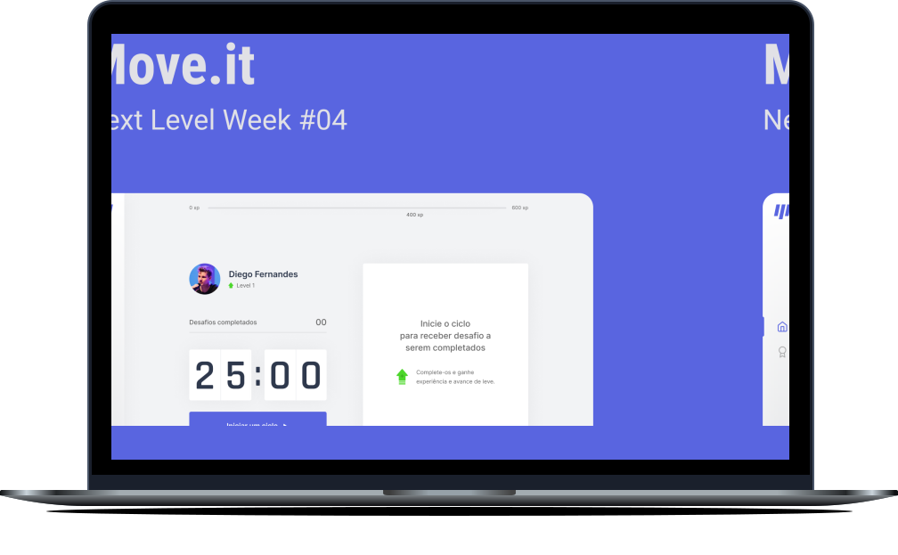

<h1 align="center">
    
</h1>

<p align="center">
  <a href="#-project-description">Project Description</a>&nbsp;&nbsp;&nbsp;|&nbsp;&nbsp;&nbsp;
  <a href="#-technologies">Technologies</a>&nbsp;&nbsp;&nbsp;|&nbsp;&nbsp;&nbsp;
  <!-- <a href="#getting-started">Getting started</a>&nbsp;&nbsp;&nbsp;|&nbsp;&nbsp;&nbsp; -->
  <a href="#-layout">Layout</a>&nbsp;&nbsp;&nbsp;|&nbsp;&nbsp;&nbsp;
  <a href="#-license">License</a>
</p>

<p align="center">
  
  
  

  
</p>

<br>

<p align="center">
  
</p>

## 💻 Project Description

<b><i>"Move It is you in movement"</i></b>, a gamified Pomodoro based application, that reminds you to exercise. 🏋️

This is a project developed during the **[Next Level Week](https://nextlevelweek.com/)**, presented by **[@Rocketseat](https://github.com/Rocketseat)** on February 2021.

## 🧪 Technologies

This project was developed using the following technologies:

- [Next.js](https://nextjs.org/)
- [React](https://reactjs.org)
- [TypeScript](https://www.typescriptlang.org/)

## 🚀 Getting started

Clone the project and access the folder

```bash
$ git clone https://github.com/jpmmadeira/moveit.git && cd moveit
```

Follow the steps below

```bash
# Install the dependencies
$ yarn or npm install

# Start the project
$ yarn dev or npm run dev
```

## 🔖 Layout

You can view the project layout through the links below:

- [Layout Web 1.0](https://www.figma.com/file/ge20pu3ofMOKoliUyKx1Nl/Move.it-1.0)
- [Layout Web 2.0](https://www.figma.com/file/7tXndNnentETZjBt4MEeU3/Move.it-2.0-Copy)

Remembering that you need to have a [Figma](http://figma.com/) account to access it.

## 📝 License

This project is licensed under the MIT License. See the [LICENSE](LICENSE.md) file for details.

---

Developed by [João Madeira](https://www.joaomadeira.net)
